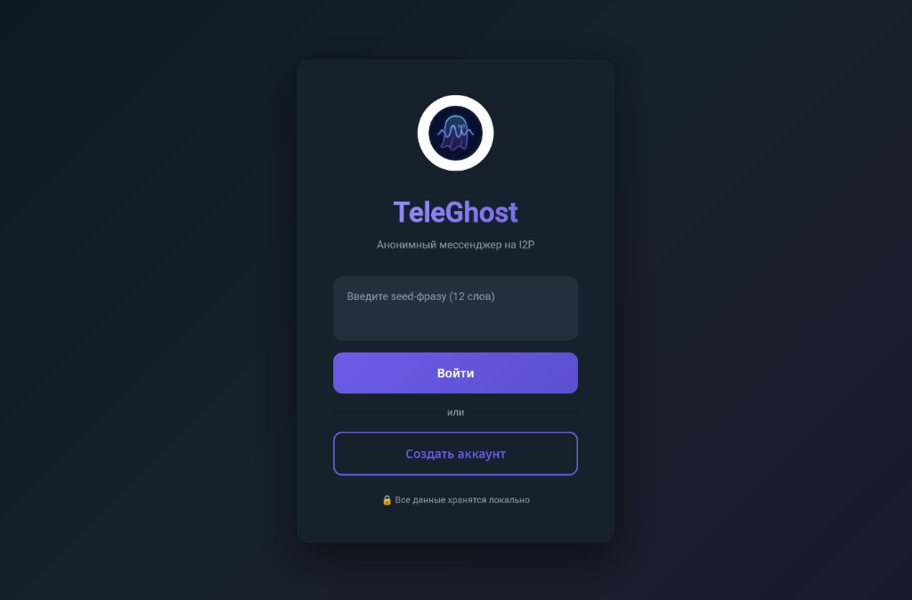
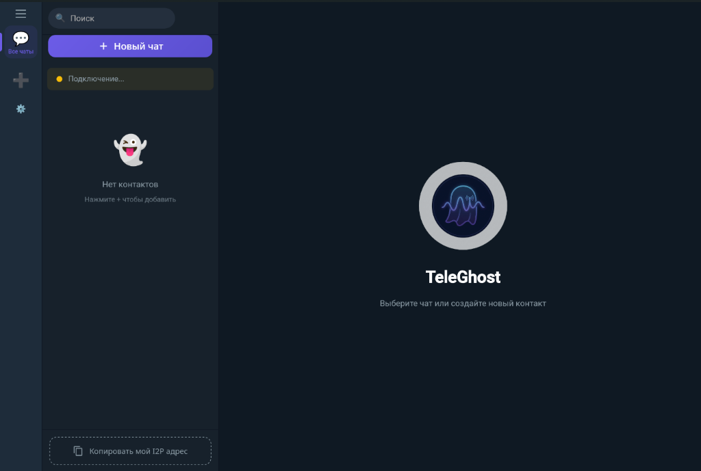

# TeleGhost 👻 

[English version / Английская версия](README_EN.md)

---

**TeleGhost** — это современный, быстрый и анонимный мессенджер, работающий внутри сети I2P. Он обеспечивает высокую степень приватности и безопасности общения, используя сквозное шифрование и скрытые сетевые туннели.

### ✨ Особенности

- **Анонимность из коробки**: Весь трафик идет через встроенный узел **i2pd**, скрывая ваш реальный IP-адрес.
- **Сквозное шифрование (E2EE)**: Ваши сообщения могут быть прочитаны только вами и вашим собеседником.
- **Папки для чатов**: Организуйте свои контакты так, как вам удобно. Теперь с поддержкой эмодзи-иконок!
- **Аватарки и Профили**: Персонализируйте свой аккаунт, ваши данные синхронизируются с контактами через I2P (в реальном времени).
- **Быстрый поиск**: Находите нужные чаты и сообщения мгновенно.
- **Премиальный UI**: Современный дизайн с поддержкой темных тем и плавных анимаций.

## 📸 Скриншоты

<p align="center">
  
  &nbsp;
  
</p>

## 🚀 Быстрый старт

### Скачать

Вы можете скачать последние готовые версии TeleGhost для вашей системы со страницы [Релизов](https://github.com/kiktor12358/TeleGhost/releases/latest):

*   **Windows**: Скачайте `TeleGhost.exe`, запустите и мессенджер готов к работе (включает встроенный роутер i2pd).
*   **Linux**: Скачайте `TeleGhost-linux-amd64`, сделайте файл исполняемым (`chmod +x TeleGhost-linux-amd64`) и запустите.

---

## 🗺 Дорожная карта (Roadmap)

### 1. Этап «Rich Media» (В работе)
- **Голосовые сообщения**: Сжатие в Opus + нарезка на чанки для стабильной передачи.
- ~~**Файлы и Фото**: Предварительное сжатие на клиенте и механизм докачки (Resume capability).~~
- **Локальная безопасность**: Шифрование базы данных SQLite ключом из Seed-фразы.

### 2. Этап «GhostMail & Federation»
- **Оффлайн-доставка**: Гибридная схема P2P + Домашние серверы (Store-and-Forward).
- **Федерация серверов**: Обмен зашифрованной почтой между доверенными узлами.
- **Анти-спам**: Внедрение Proof-of-Work (RandomX/SHA) перед отправкой незнакомцам.

### 3. Этап «Real-Time & Mobility»
- **Звонки**: Аудио-звонки через UDP (SSU2).
- ~~**Профили защиты**: Переключение режимов туннелирования (🚀 **Fast**, 🛡️ **Default**, 👻 **Invisible**).~~
- **Мобильная адаптация**: Оптимизация Go-ядра для работы на смартфонах и создание полноценного мобильного клиента.


---

## 🚀 Технологии

- **Backend**: Go (Golang)
- **Frontend**: Svelte, Vite
- **Network**: I2P (i2pd) via SAM bridge
- **Database**: SQLite3
- **Framework**: [Wails v2](https://wails.io)

## 🛠 Установка и запуск

### Требования
- Go 1.21+
- Node.js & npm
- Wails CLI (`go install github.com/wailsapp/wails/v2/cmd/wails@latest`)

### Запуск в режиме разработки
```bash
wails dev
```

### Сборка приложения
```bash
wails build -tags cgo_i2pd
```

## 🔐 Безопасность
TeleGhost не использует централизованные серверы. Все данные хранятся локально на вашем устройстве, а передача осуществляется напрямую между I2P-узлами.

## 📄 Лицензия
Распространяется по лицензии MIT. Подробности см. в файле `LICENSE`.

---
*Разработано с заботой о приватности.*
